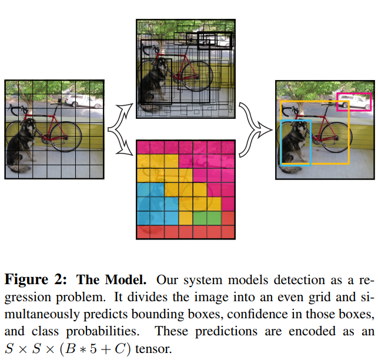
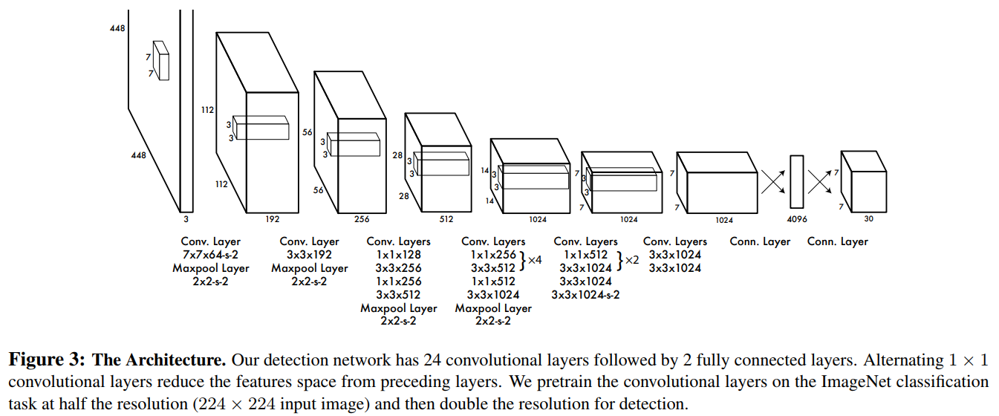

# YOLO v1
> Paper link: [You Only Look Once: Unified, Real-Time Object Detection](https://pjreddie.com/media/files/papers/yolo.pdf)

## Unified Detection
- Divide the input into an S x S grid
- Each grid cell predicts B bounding boxes and confidence
    - Note: grid cell != bouding box
- Confidence: reflects how confident the model believe the cell contains an object and how the accurate the box is predicted
    - confidence defined as: 
    - confidence = 0, if no object in the cell
- Each bounding box consists of 5 predictions: `x, y, w, h, confidence`
    - x, y: center of the box
    - w, h: relative to the whole image
    - confidence: the confidence prediction represents the IOU between the predicted box and any ground truth box
- Each grid cell predicts C conditional class probabilities: 
    - predict 1 set of class probabilities per grid cell, regardless of the number of bounding boxes B
    - At test time, we get class-specific confidence score for each box by computing:
    
    
    
    
- On `PASCAL VOC`, set S=7, B=2, C=20 (20 classes), hence tensor number is 7x7x30
    
### Network Design
- Initial `conv` layers extract features, `fc` layers predict the output probabilities and coordinates
- 24 `conv` layers + 2 `fc` layers

### Training
- Pretrain `conv` layers on the `ImageNet`
    - Used first 20 `conv` layers followed by 1 `avgPool` layer and 1 `fc` layer
    - Training time: 1 week, top-5 accuracy: 88% on `val` set
- Training by adding 4 `conv` layers and 2 `fc` layers with random initialization
    - Input resolution set to 448 x 448
    - Normalize the bounding box `w` and `h` by the image width and height (0~1)
    - Making `x` and `y` to be offsets of a particular grid cell location (0~1)
    - Activation function: 0\\&space;\\&space;0.1x,&space;otherwise&space;\end{array}&space;\right." title="\phi(x) = \left\{ \begin{array}{ll} x, if x>0\\ \\ 0.1x, otherwise \end{array} \right." />
    - Optimize for `sum-square error` (easy to optimize but isn't perfectly suitable for the task)
    - To make `sum-square error` work better
        - Increase the loss of bounding box coordinate prediction
        - Decrease the loss of confidence for boxes don't contain objects
        -  and 
        - Predict the square root of the bounding box width and height to make smaller boxes matter more
        
    
    