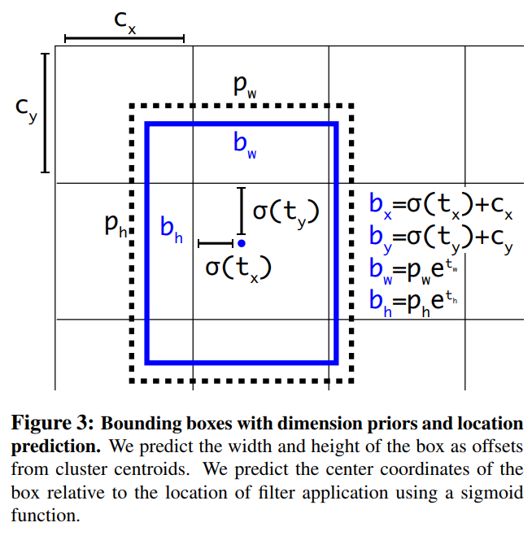
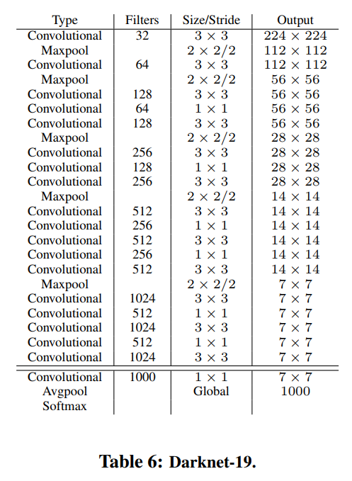

# YOLO v2
> Paper link: [YOLO9000: Better, Faster, Stronger](https://arxiv.org/pdf/1612.08242.pdf)

## Better
- YOLO v1 makes a lot of localization errors and has low recall

### Batch Normalization
- Significantly improves convergence (+2% mAP)
- Could remove `dropout` without overfitting

### High Resolution Classifier
- `YOLO v2` fine tunes the classification at 448 x 448 resolution for 10 epochs on `ImageNet`
- Then fine tune the resulting network on detection (+4% mAP)

### Convolutional With Anchor Boxes
- Using `anchors` like Faster R-CNN
- Remove `FC` layers from YOLO and use `anchor` to predict bounding boxes (-0.3% mAP, +7% recall)
    - eliminate one `pooling` layer to make the output of `conv` layer higher resolution
    - shrink the network to operate on 416 input images instead of 448 x 448 
        - get odd number of locations in feature map so we have a single center cell which is good for large objects detection
        - `conv` layers downsample the image by a factor of 32, hence we have 13 x 13 feature map from image with size 416
    
### Dimension Clusters
- run `k-means clustering` on the training set bounding boxes to automatically find food `anchor` priors
- distance metric: 
- k = 5
    
### Direct Location Prediction
model instability due to the use of `anchor`, mostly from (x, y) prediction
- 
- 

- The network predicts 5 coordinates for each bounding box (+5% mAP)
    - 
    - 
    - 
    - 
    - 
    - the cell is offset from the top left of the image by 
    - the bounding box prior has width and height 

### Fine-Grained Features
- add a `passthrough` layer that brings features from an earlier layer at 26 x 26 resolution

### Multi-scale Training
Make network predict well for various input size:
- instead of fixing the input image size, YOLOv2 changes the network every few iterations
    - choose a new image dimension size for every 10 batches
        - scale from {320, 320 + 32 * 1, ..., 320 + 32 * 9}, since downsample factor is 32

## Faster
`VGG-16` too complicated

### Darknet-19

### Training for classification
- trains on `ImageNet` 1000 classes
- 160 `epochs` using `SGD`
- `lr` = 0.1
- polynomial rate `decay` with a power of 4
- `weight decay` = 0.0005
- `momentum` = 0.9
- standard `data augmentation`
    - random crop
    - rotation
    - hue
    - saturation
    - exposure shift
- fine tune network at input image size 448 for 10 `epochs` with `lr` = 0.001

### Training for detection
- removing last `conv` layer and add 3 3x3 `conv` layer with the number of outputs we need
    - for `VOC`: 5 boxes with 5 coordinates each and 30 classes per box so 125 filters
- add `passthrough` layer from final 3x3x512 layer to the second to last `conv` layer to enable `fine grain features`
- 160 `epochs`
- `lr` = 0.001, dividing it by 10 at 60 and 90 `epochs`
- `weight decay` = 0.0005, `momentum` = 0.9
- same `data augmentation` techniques

## Stronger (YOLO: 9000)
Jointly Training on classification and detection data
- during training, we mix images from both detection and classification datasets
    - backprop based on the full `YOLO v2` loss function when sees an image labeled for detection
    - backprop based only on loss from classification specific part if seens an classification image
- need to merge classification (more specific) and detection (general) labels

...